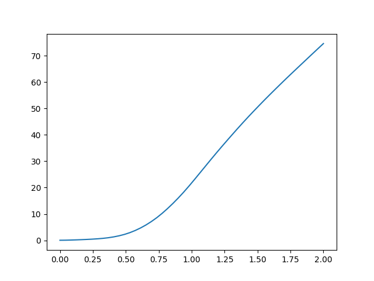
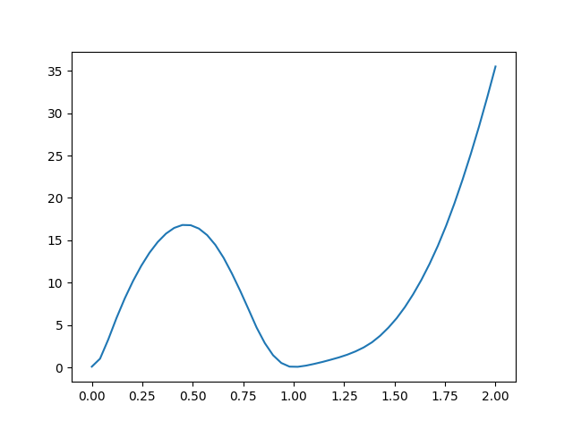

# Visualization of loss landscape (surface)
Loss curve (loss-t) sometimes cannot convey enough information. For example:

(1) If the loss has large fluctuations, the learning rate is too big? or the loss surface is too sharp? 

(2) If the loss do not decrease, is local optima? Or saddle points? Or the loss surface is too flat?

Thus, we need the loss landscape to help us visualize what is the property of the current converged paramters $\theta^*$.

# Experiments
Our experiments is based on GNN node classification task. The graph dataset is generated from pytorch FakeDataset, user can assign graph size N, node feature dimension D, class number C.

In our experiments, N~=500, D=128, C=2. We use two layer GCN model, with hidden dimension $h=16$.
## 1D plot: linear interpolation
See Exp_1 and Exp_2.
### Exp_1: 
We do linear interpolation between random initilaized $\theta^0$ and corresponding optimized $\theta^*$:

$$\alpha\theta^0+(1-\alpha)\theta^*$$

where $\alpha\in[0,2]$

We see that the loss well-behaved between $\theta^0$ and $\theta^*$, the curve is convex.

### Exp_2:
We do linear interpolation between two optimized $\theta_1^*$ and corresponding optimized $\theta_2^*$:

$$\alpha\theta_1^*+(1-\alpha)\theta_2^*$$

We see that the loss also well-behaved.

According to [1], The 1D linear interpolation method suffers from several weaknesses. It is difficult to visualize non-convexities using 1D plots.

### Exp_5: 
Origin is risky saddle points!
(TODO: not obvious.)

## 2D plot: bilinear interpolation
See Exp_3.
### Exp_3
For 1D-plot, the 1D subspace is the direction between two points: $\theta^0$ and $\theta^*$ or $\theta_1^*$ and $\theta_2^*$.

For 2D-plot, we also need to select 2D subspace. One idea is to do bilinear interpolation between 4 points:

- two random initialzied points $\theta_1^0$ and $\theta_2^0$, which corresponding optimized points $\theta_1^*$ and $\theta_2^*$.

## 2D plot: random direction
See Exp_4.

## Eigenvalue: random direction
See Exp_6. # TODO
# Reference
[1] Visualizing the Loss Landscape of Neural Nets: https://arxiv.org/abs/1712.09913
